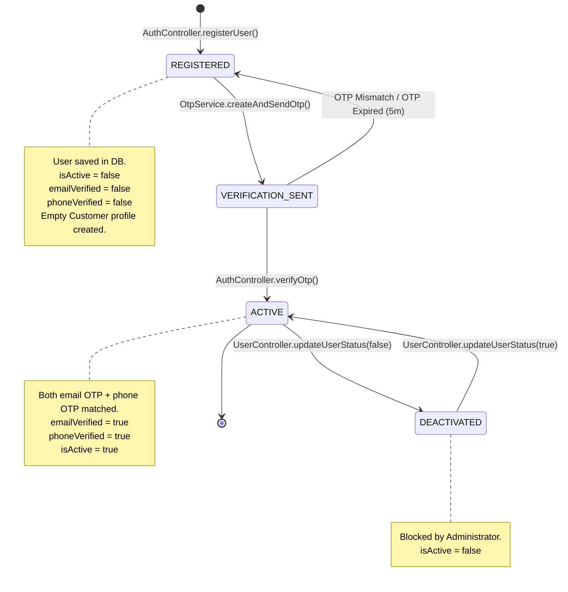
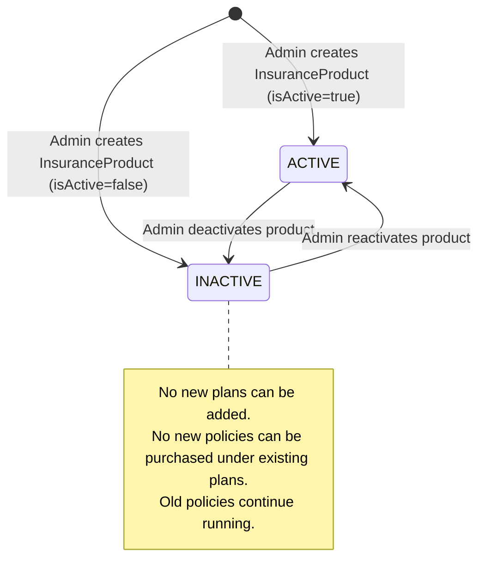
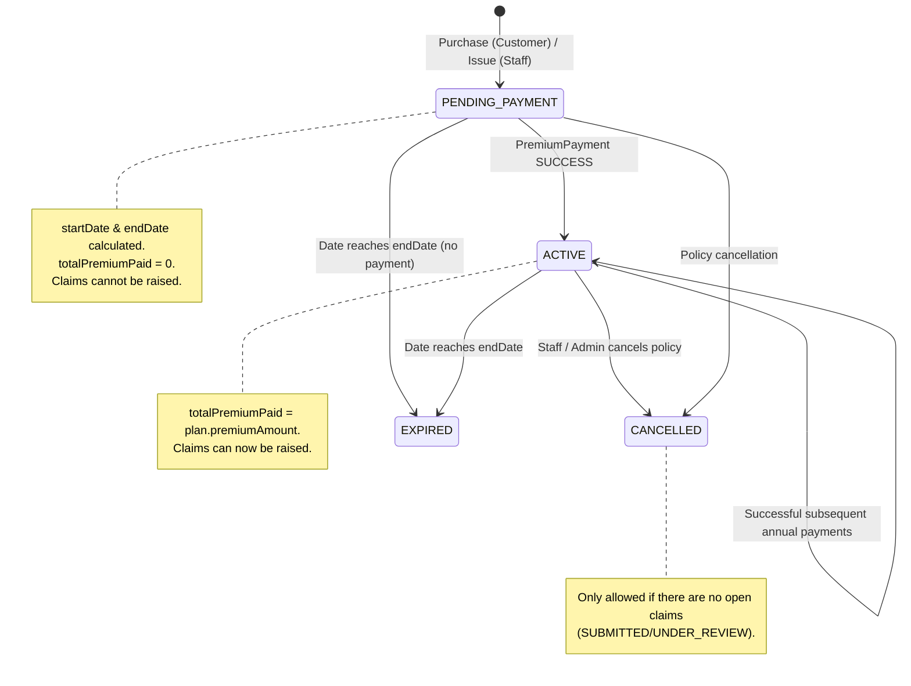
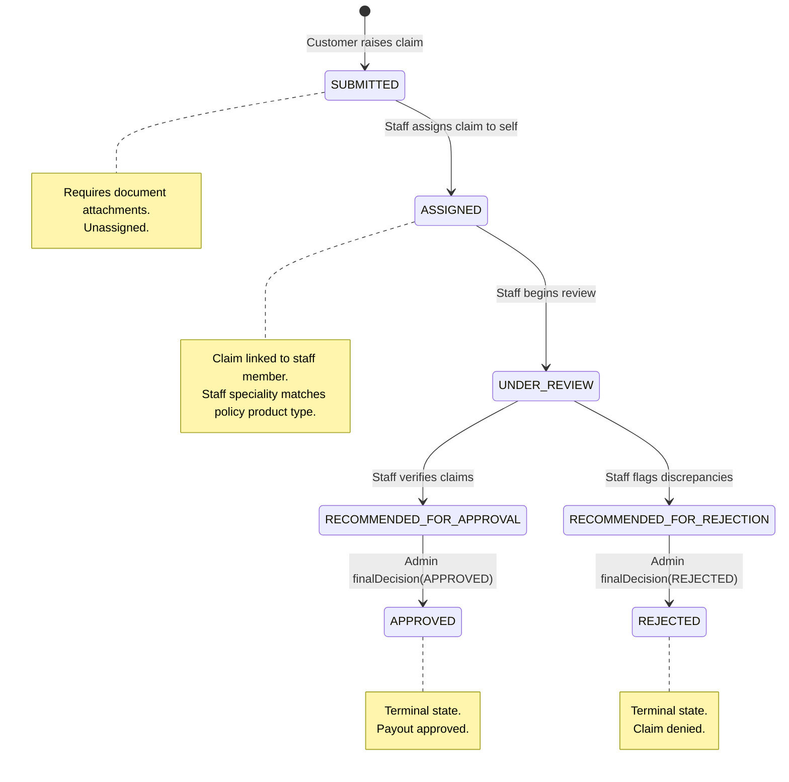

# Domain-Driven Business Workflows

This document outlines key lifecycle stages and state machine transitions for core business flows.

---

## 1. User Lifecycle State Machine

Users transition across verification levels before obtaining system access:

---

## 2. Insurance Product Lifecycle

Managed strictly by system Administrators:

---

## 3. Insurance Policy Lifecycle

Policies track actual client coverage contracts:

---

## 4. Claim Processing State Machine

Tracks claim stages, assignments, reviews, and decision logic:

