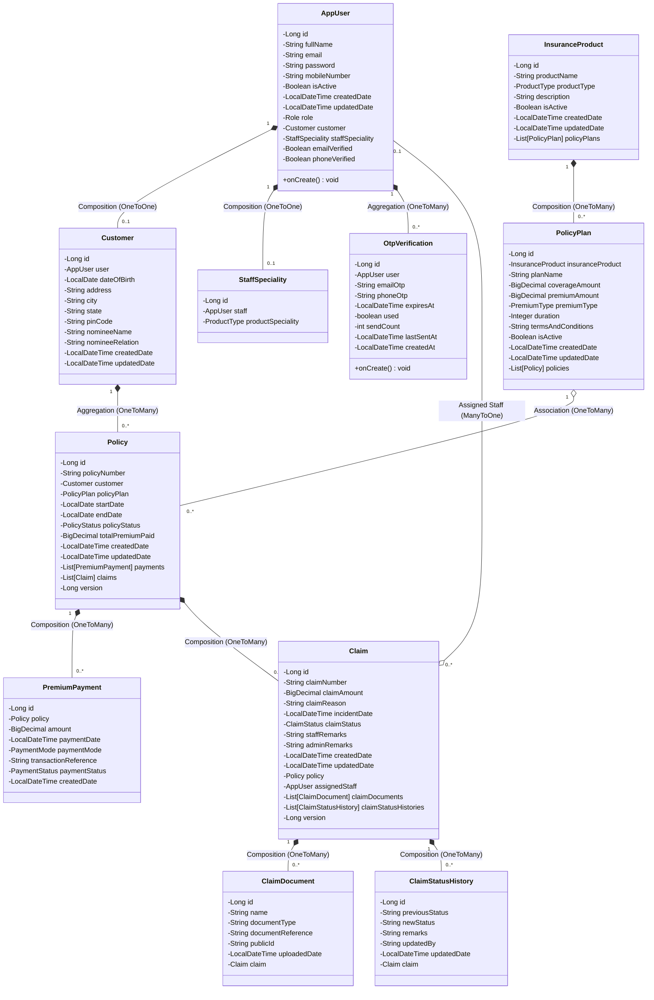
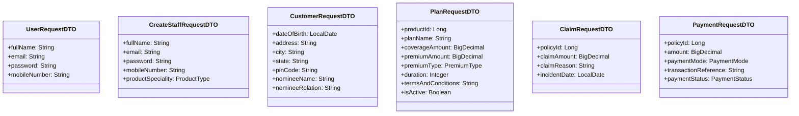

# UML Class Diagrams

This document outlines structural relationships, compositions, inheritances, and dependencies across all layers of the Insurance Policy Claim Management System.

---

## 1. Domain Entities & Database Model Layer

Represents JPA entities, mappings, and relationships mapping to the tables of `insurance_db`.

---

## 2. Controllers & API Services Layer

REST Controllers expose web endpoints and delegate processing logic directly to service layers.

```mermaid
classDiagram
    direction LR
    class AuthController {
        -AuthService authService
        +login(LoginRequestDTO) ResponseEntity
        +registerUser(UserRequestDTO) ResponseEntity
        +verifyOtp(VerifyOtpRequest) ResponseEntity
        +resendOtp(ResendOtpRequestDTO) ResponseEntity
        +forgotPassword(ForgotPasswordRequestDTO) ResponseEntity
        +resetPassword(ResetPasswordRequestDTO) ResponseEntity
    }

    class CustomerController {
        -CustomerService customerService
        +createProfile(CustomerRequestDTO) ResponseEntity
        +updateProfile(Long, CustomerRequestDTO) ResponseEntity
        +getProfile() ResponseEntity
        +getAllCustomers(int, int) ResponseEntity
        +getPaginatedCustomers(int, int, String, String, String) ResponseEntity
        +getCustomerById(Long) ResponseEntity
    }

    class ClaimController {
        -ClaimService claimService
        +raiseClaim(ClaimRequestDTO, List[MultipartFile]) ResponseEntity
        +getMyClaims(int, int, String, String) ResponseEntity
        +getAllClaims(int, int, String, String, String, String) ResponseEntity
        +getClaimById(Long) ResponseEntity
        +getClaimHistory(Long, int, int, String, String, String, String) ResponseEntity
        +underReview(Long) ResponseEntity
        +assignStaff(Long) ResponseEntity
        +reviewClaim(Long, ClaimReviewRequestDTO) ResponseEntity
        +finalDecision(Long, ClaimReviewRequestDTO) ResponseEntity
    }

    class PolicyController {
        -PolicyService policyService
        +purchasePolicy(PolicyPurchaseRequestDTO) ResponseEntity
        +issuePolicy(PolicyIssueRequestDTO) ResponseEntity
        +getMyPolicies(int, int, String, String) ResponseEntity
        +getPoliciesByCustomer(Long, int, int, String, String) ResponseEntity
        +getAllPolicies(int, int, String, String, String, String, String) ResponseEntity
        +getPolicyById(Long) ResponseEntity
        +getClaimsByPolicyId(Long, int, int, String, String) ResponseEntity
        +cancelPolicy(Long) ResponseEntity
    }

    class PremiumPaymentController {
        -PremiumPaymentService paymentService
        +recordPayment(PaymentRequestDTO) ResponseEntity
        +getPaymentsByPolicyId(Long, int, int, String, String) ResponseEntity
        +getPaymentById(Long) ResponseEntity
        +getPaginatedPayments(int, int, String, String, String, String) ResponseEntity
        +getMyPayments(int, int, String, String) ResponseEntity
        +getMyPaymentsByPolicyId(Long, int, int, String, String) ResponseEntity
    }

    class InsuranceProductController {
        -InsuranceProductService productService
        +createProduct(InsuranceRequestDTO) ResponseEntity
        +updateProduct(Long, ProductRequestDTO) ResponseEntity
        +deactivateProduct(Long) ResponseEntity
        +activateProduct(Long) ResponseEntity
        +getActiveProducts() ResponseEntity
        +getPaginatedProducts(int, int, String, String, String) ResponseEntity
        +getProductById(Long) ResponseEntity
    }

    class PolicyPlanController {
        -PolicyPlanService planService
        +createPlan(PlanRequestDTO) ResponseEntity
        +updatePlan(Long, PlanRequestDTO) ResponseEntity
        +deactivatePlan(Long) ResponseEntity
        +activatePlan(Long) ResponseEntity
        +getActivePlans() ResponseEntity
        +getActivePlansByProduct(Long) ResponseEntity
        +getPaginatedPlans(int, int, String, String, String, String) ResponseEntity
        +getPlanById(Long) ResponseEntity
    }

    class UserController {
        -UserService userService
        +getAllUsers(int, int, String, String) ResponseEntity
        +getUserById(Long) ResponseEntity
        +updateUserStatus(Long, UserStatusUpdateRequestDTO) ResponseEntity
        +createInternalStaff(CreateStaffRequestDTO) ResponseEntity
    }

    class ClaimDocumentController {
        -ClaimDocumentService claimDocumentService
        +uploadDocument(Long, String, MultipartFile) ResponseEntity
    }

    %% Dependency mapping to Service contracts
    AuthController ..> AuthService : depends
    CustomerController ..> CustomerService : depends
    ClaimController ..> ClaimService : depends
    PolicyController ..> PolicyService : depends
    PremiumPaymentController ..> PremiumPaymentService : depends
    InsuranceProductController ..> InsuranceProductService : depends
    PolicyPlanController ..> PolicyPlanService : depends
    UserController ..> UserService : depends
    ClaimDocumentController ..> ClaimDocumentService : depends
```

---

## 3. Service Mappings & Implementations

```mermaid
classDiagram
    direction TB

    class AuthService {
        <<interface>>
        +login(LoginRequestDTO) ApiResponseDTO
        +registerUser(UserRequestDTO) ApiResponseDTO
        +verifyOtp(VerifyOtpRequest) ApiResponseDTO
        +resendOtp(ResendOtpRequestDTO) ApiResponseDTO
        +forgotPassword(ForgotPasswordRequestDTO) ApiResponseDTO
        +resetPassword(ResetPasswordRequestDTO) ApiResponseDTO
    }

    class AuthServiceImpl {
        -AppUserRepository userRepository
        -CustomerRepository customerRepository
        -PasswordEncoder passwordEncoder
        -JwtService jwtService
        -UserService userService
        -OtpService otpService
    }
    AuthService <|.. AuthServiceImpl : implements

    class ClaimService {
        <<interface>>
        +raiseClaim(ClaimRequestDTO, List[MultipartFile]) ApiResponseDTO
        +getMyClaims(int, int, String, String) ApiResponseDTO
        +getAllClaims(int, int, String, String, String, String) ApiResponseDTO
        +getClaimById(Long) ApiResponseDTO
        +getClaimHistory(Long, int, int, String, String, String, String) ApiResponseDTO
        +underReviewClaim(Long) ApiResponseDTO
        +assignStaff(Long) ApiResponseDTO
        +reviewClaim(Long, ClaimReviewRequestDTO) ApiResponseDTO
        +finalDecisionOnClaim(Long, ClaimReviewRequestDTO) ApiResponseDTO
    }

    class ClaimServiceImpl {
        -ClaimRepository claimRepository
        -PolicyRepository policyRepository
        -AppUserRepository userRepository
        -ClaimDocumentService documentService
        -ClaimStatusHistoryRepository historyRepository
    }
    ClaimService <|.. ClaimServiceImpl : implements

    class PolicyService {
        <<interface>>
        +purchasePolicy(PolicyPurchaseRequestDTO) ApiResponseDTO
        +issuePolicy(PolicyIssueRequestDTO) ApiResponseDTO
        +getMyPolicies(int, int, String, String) ApiResponseDTO
        +getPoliciesByCustomer(Long, int, int, String, String) ApiResponseDTO
        +getAllPolicies(int, int, String, String, String, String, String) ApiResponseDTO
        +getPolicyById(Long) ApiResponseDTO
        +getClaimsByPolicyId(Long, int, int, String, String) ApiResponseDTO
        +cancelPolicy(Long) ApiResponseDTO
    }

    class PolicyServiceImpl {
        -PolicyRepository policyRepository
        -CustomerRepository customerRepository
        -PolicyPlanRepository planRepository
        -AppUserRepository userRepository
        -ClaimRepository claimRepository
    }
    PolicyService <|.. PolicyServiceImpl : implements

    class PremiumPaymentService {
        <<interface>>
        +recordPayment(PaymentRequestDTO) ApiResponseDTO
        +getPaymentsByPolicyId(Long, int, int, String, String) ApiResponseDTO
        +getPaymentById(Long) ApiResponseDTO
        +getPaginatedPayments(int, int, String, String, String, String) ApiResponseDTO
        +getMyPayments(int, int, String, String) ApiResponseDTO
        +getMyPaymentsByPolicyId(Long, int, int, String, String) ApiResponseDTO
    }

    class PremiumPaymentServiceImpl {
        -PremiumPaymentRepository paymentRepository
        -PolicyRepository policyRepository
        -AppUserRepository userRepository
    }
    PremiumPaymentService <|.. PremiumPaymentServiceImpl : implements
```

---

## 4. DTO & Validation Payload Schemas

Data structures mapped directly to client requests and responses:

---

## 5. Security Models & Handlers

This shows how filters, security context mechanisms, and tokens relate structurally.

