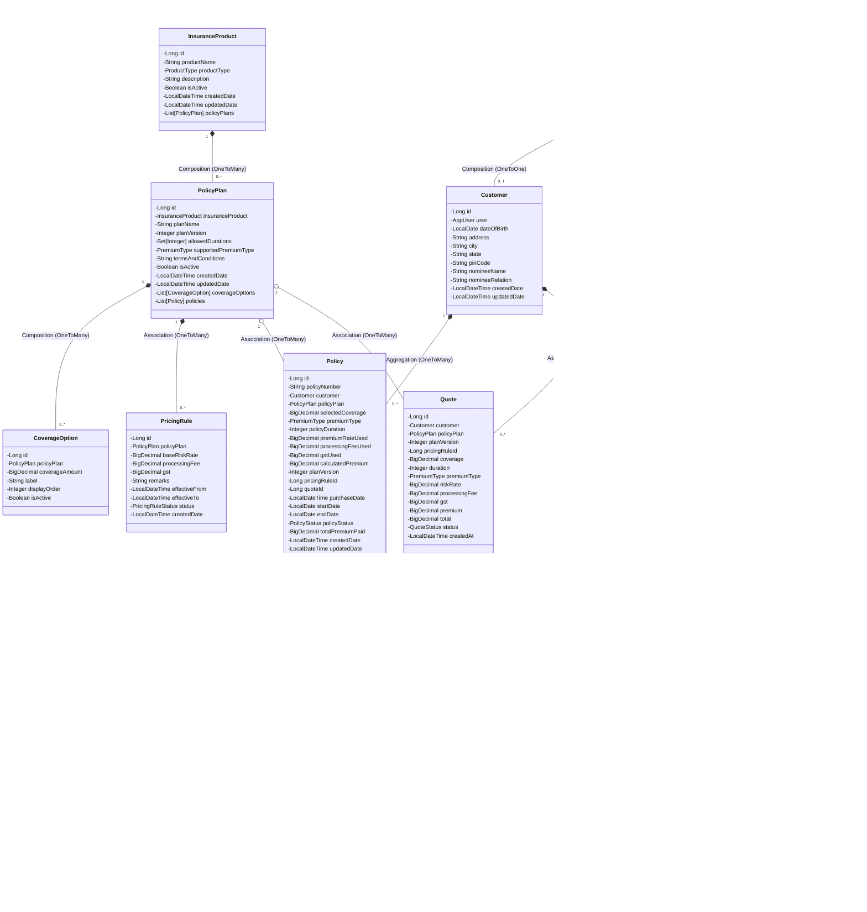
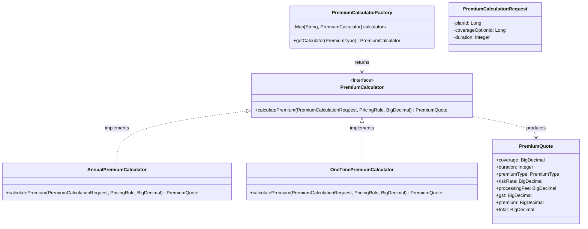
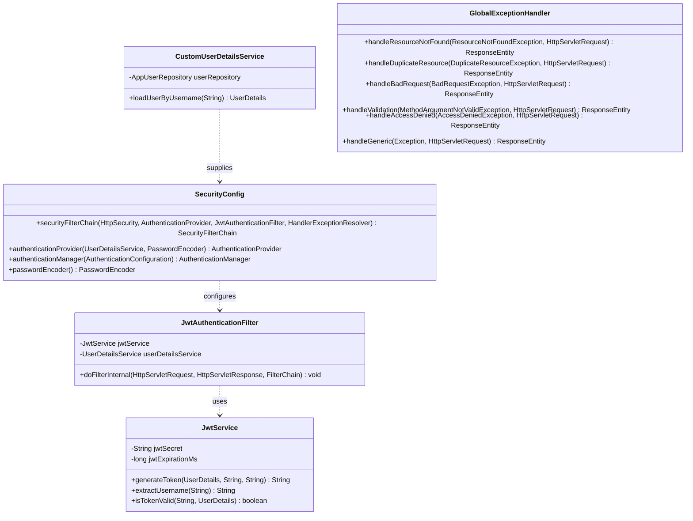

# UML Class Diagrams

This document outlines structural relationships, compositions, inheritances, and dependencies across all layers of the **Insurance Policy Claim Management System**.

---

## 1. Domain Entities & Database Model Layer

Represents JPA entities, mappings, and relationships corresponding to the tables in `insurance_db`. This includes the core user/customer entities, product and plan hierarchy, dynamic pricing rules, coverage options, quotes, policies, payments, and claims.

---

## 2. Controllers & API Services Layer

REST Controllers expose web endpoints and delegate processing logic directly to service layers.

```mermaid
classDiagram
    direction LR
    class AuthController {
        -AuthService authService
        +login(LoginRequestDTO) ResponseEntity
        +registerUser(UserRequestDTO) ResponseEntity
        +verifyOtp(VerifyOtpRequest) ResponseEntity
        +resendOtp(ResendOtpRequestDTO) ResponseEntity
        +forgotPassword(ForgotPasswordRequestDTO) ResponseEntity
        +resetPassword(ResetPasswordRequestDTO) ResponseEntity
    }

    class CustomerController {
        -CustomerService customerService
        +createProfile(CustomerRequestDTO) ResponseEntity
        +updateProfile(Long, CustomerRequestDTO) ResponseEntity
        +getProfile() ResponseEntity
        +getAllCustomers(int, int) ResponseEntity
        +getPaginatedCustomers(int, int, String, String, String) ResponseEntity
        +getCustomerById(Long) ResponseEntity
    }

    class InsuranceProductController {
        -InsuranceProductService productService
        +createProduct(InsuranceRequestDTO) ResponseEntity
        +updateProduct(Long, ProductRequestDTO) ResponseEntity
        +deactivateProduct(Long) ResponseEntity
        +activateProduct(Long) ResponseEntity
        +getActiveProducts() ResponseEntity
        +getPaginatedProducts(int, int, String, String, String) ResponseEntity
        +getProductById(Long) ResponseEntity
    }

    class PolicyPlanController {
        -PolicyPlanService planService
        +createPlan(PlanRequestDTO) ResponseEntity
        +updatePlan(Long, PlanRequestDTO) ResponseEntity
        +deactivatePlan(Long) ResponseEntity
        +activatePlan(Long) ResponseEntity
        +getActivePlans() ResponseEntity
        +getActivePlansByProduct(Long) ResponseEntity
        +getPaginatedPlans(int, int, String, String, String, String) ResponseEntity
        +getPlanById(Long) ResponseEntity
    }

    class CoverageOptionController {
        -CoverageOptionService coverageOptionService
        +addCoverageOption(CoverageOptionRequestDTO) ResponseEntity
        +updateCoverageOption(Long, CoverageOptionRequestDTO) ResponseEntity
        +deactivateCoverageOption(Long) ResponseEntity
        +activateCoverageOption(Long) ResponseEntity
        +getCoverageOptionsByPlan(Long) ResponseEntity
    }

    class PricingRuleController {
        -PricingRuleService pricingRuleService
        +createRule(PricingRuleRequestDTO) ResponseEntity
        +updateRule(Long, PricingRuleRequestDTO) ResponseEntity
        +getActiveRule(Long) ResponseEntity
        +getRuleHistory(Long) ResponseEntity
    }

    class PremiumCalculationController {
        -PremiumCalculationService calculationService
        +previewPremium(PricingPreviewRequestDTO) ResponseEntity
    }

    class PolicyController {
        -PolicyService policyService
        +purchasePolicy(PolicyPurchaseRequestDTO) ResponseEntity
        +issuePolicy(PolicyIssueRequestDTO) ResponseEntity
        +getMyPolicies(int, int, String, String) ResponseEntity
        +getPoliciesByCustomer(Long, int, int, String, String) ResponseEntity
        +getAllPolicies(int, int, String, String, String, String, String) ResponseEntity
        +getPolicyById(Long) ResponseEntity
        +getClaimsByPolicyId(Long, int, int, String, String) ResponseEntity
        +cancelPolicy(Long) ResponseEntity
    }

    class PremiumPaymentController {
        -PremiumPaymentService paymentService
        +recordPayment(PaymentRequestDTO) ResponseEntity
        +getPaymentsByPolicyId(Long, int, int, String, String) ResponseEntity
        +getPaymentById(Long) ResponseEntity
        +getPaginatedPayments(int, int, String, String, String, String) ResponseEntity
        +getMyPayments(int, int, String, String) ResponseEntity
        +getMyPaymentsByPolicyId(Long, int, int, String, String) ResponseEntity
    }

    class ClaimController {
        -ClaimService claimService
        +raiseClaim(ClaimRequestDTO, List[MultipartFile]) ResponseEntity
        +getMyClaims(int, int, String, String) ResponseEntity
        +getAllClaims(int, int, String, String, String, String) ResponseEntity
        +getClaimById(Long) ResponseEntity
        +getClaimHistory(Long, int, int, String, String, String, String) ResponseEntity
        +underReview(Long) ResponseEntity
        +assignStaff(Long) ResponseEntity
        +reviewClaim(Long, ClaimReviewRequestDTO) ResponseEntity
        +finalDecision(Long, ClaimReviewRequestDTO) ResponseEntity
    }

    class ClaimDocumentController {
        -ClaimDocumentService claimDocumentService
        +uploadDocument(Long, String, MultipartFile) ResponseEntity
    }

    class UserController {
        -UserService userService
        +getAllUsers(int, int, String, String) ResponseEntity
        +getUserById(Long) ResponseEntity
        +updateUserStatus(Long, UserStatusUpdateRequestDTO) ResponseEntity
        +createInternalStaff(CreateStaffRequestDTO) ResponseEntity
    }

    %% Dependency mapping to Service contracts
    AuthController ..> AuthService : depends
    CustomerController ..> CustomerService : depends
    InsuranceProductController ..> InsuranceProductService : depends
    PolicyPlanController ..> PolicyPlanService : depends
    CoverageOptionController ..> CoverageOptionService : depends
    PricingRuleController ..> PricingRuleService : depends
    PremiumCalculationController ..> PremiumCalculationService : depends
    PolicyController ..> PolicyService : depends
    PremiumPaymentController ..> PremiumPaymentService : depends
    ClaimController ..> ClaimService : depends
    ClaimDocumentController ..> ClaimDocumentService : depends
    UserController ..> UserService : depends
```

---

## 3. Service Layer & Dynamic Pricing Strategy Pattern

Illustrates the service interfaces and implementations, including the Strategy pattern used for dynamic premium calculations (`ANNUAL` vs. `ONE_TIME` calculators).

```mermaid
classDiagram
    direction TB

    class AuthService {
        <<interface>>
        +login(LoginRequestDTO) ApiResponseDTO
        +registerUser(UserRequestDTO) ApiResponseDTO
        +verifyOtp(VerifyOtpRequest) ApiResponseDTO
        +resendOtp(ResendOtpRequestDTO) ApiResponseDTO
        +forgotPassword(ForgotPasswordRequestDTO) ApiResponseDTO
        +resetPassword(ResetPasswordRequestDTO) ApiResponseDTO
    }

    class AuthServiceImpl {
        -AppUserRepository userRepository
        -CustomerRepository customerRepository
        -PasswordEncoder passwordEncoder
        -JwtService jwtService
        -UserService userService
        -OtpService otpService
    }
    AuthService <|.. AuthServiceImpl : implements

    class PolicyPlanService {
        <<interface>>
        +createPlan(PlanRequestDTO) ApiResponseDTO
        +updatePlan(Long, PlanRequestDTO) ApiResponseDTO
        +deactivatePlan(Long) ApiResponseDTO
        +activatePlan(Long) ApiResponseDTO
        +getActivePlans() ApiResponseDTO
        +getActivePlansByProduct(Long) ApiResponseDTO
        +getPaginatedPlans(int, int, String, String, String, String) ApiResponseDTO
        +getPlanById(Long) ApiResponseDTO
    }

    class PolicyPlanServiceImpl {
        -PolicyPlanRepository planRepository
        -InsuranceProductRepository productRepository
        -CoverageOptionRepository coverageOptionRepository
    }
    PolicyPlanService <|.. PolicyPlanServiceImpl : implements

    class CoverageOptionService {
        <<interface>>
        +addCoverageOption(CoverageOptionRequestDTO) ApiResponseDTO
        +updateCoverageOption(Long, CoverageOptionRequestDTO) ApiResponseDTO
        +deactivateCoverageOption(Long) ApiResponseDTO
        +activateCoverageOption(Long) ApiResponseDTO
        +getCoverageOptionsByPlan(Long) ApiResponseDTO
    }

    class CoverageOptionServiceImpl {
        -CoverageOptionRepository coverageOptionRepository
        -PolicyPlanRepository planRepository
    }
    CoverageOptionService <|.. CoverageOptionServiceImpl : implements

    class PricingRuleService {
        <<interface>>
        +createRule(PricingRuleRequestDTO) ApiResponseDTO
        +updateRule(Long, PricingRuleRequestDTO) ApiResponseDTO
        +getActiveRule(Long) ApiResponseDTO
        +getRuleHistory(Long) ApiResponseDTO
    }

    class PricingRuleServiceImpl {
        -PricingRuleRepository pricingRuleRepository
        -PolicyPlanRepository planRepository
        -PricingAuditLogRepository auditLogRepository
    }
    PricingRuleService <|.. PricingRuleServiceImpl : implements

    class PremiumCalculationService {
        <<interface>>
        +previewPremium(PricingPreviewRequestDTO) ApiResponseDTO
        +generateQuote(Long, Long, Integer) Quote
    }

    class PremiumCalculationServiceImpl {
        -PolicyPlanRepository planRepository
        -CoverageOptionRepository coverageOptionRepository
        -PricingRuleRepository pricingRuleRepository
        -QuoteRepository quoteRepository
        -PremiumCalculatorFactory calculatorFactory
    }
    PremiumCalculationService <|.. PremiumCalculationServiceImpl : implements

    class PolicyService {
        <<interface>>
        +purchasePolicy(PolicyPurchaseRequestDTO) ApiResponseDTO
        +issuePolicy(PolicyIssueRequestDTO) ApiResponseDTO
        +getMyPolicies(int, int, String, String) ApiResponseDTO
        +getPoliciesByCustomer(Long, int, int, String, String) ApiResponseDTO
        +getAllPolicies(int, int, String, String, String, String, String) ApiResponseDTO
        +getPolicyById(Long) ApiResponseDTO
        +getClaimsByPolicyId(Long, int, int, String, String) ApiResponseDTO
        +cancelPolicy(Long) ApiResponseDTO
    }

    class PolicyServiceImpl {
        -PolicyRepository policyRepository
        -CustomerRepository customerRepository
        -PolicyPlanRepository planRepository
        -CoverageOptionRepository coverageOptionRepository
        -PricingRuleRepository pricingRuleRepository
        -PremiumCalculationService calculationService
    }
    PolicyService <|.. PolicyServiceImpl : implements

    class ClaimService {
        <<interface>>
        +raiseClaim(ClaimRequestDTO, List[MultipartFile]) ApiResponseDTO
        +getMyClaims(int, int, String, String) ApiResponseDTO
        +getAllClaims(int, int, String, String, String, String) ApiResponseDTO
        +getClaimById(Long) ApiResponseDTO
        +getClaimHistory(Long, int, int, String, String, String, String) ApiResponseDTO
        +underReviewClaim(Long) ApiResponseDTO
        +assignStaff(Long) ApiResponseDTO
        +reviewClaim(Long, ClaimReviewRequestDTO) ApiResponseDTO
        +finalDecisionOnClaim(Long, ClaimReviewRequestDTO) ApiResponseDTO
    }

    class ClaimServiceImpl {
        -ClaimRepository claimRepository
        -PolicyRepository policyRepository
        -AppUserRepository userRepository
        -ClaimDocumentService documentService
        -ClaimStatusHistoryRepository historyRepository
    }
    ClaimService <|.. ClaimServiceImpl : implements
```

### Strategy Pattern for Dynamic Premium Calculations

---

## 4. DTO & Validation Payload Schemas

Data structures mapped directly to client requests, wizards, dynamic pricing previews, and responses:

```mermaid
classDiagram
    class UserRequestDTO {
        +fullName: String
        +email: String
        +password: String
        +mobileNumber: String
    }
    class CreateStaffRequestDTO {
        +fullName: String
        +email: String
        +password: String
        +mobileNumber: String
        +productSpeciality: ProductType
    }
    class CustomerRequestDTO {
        +dateOfBirth: LocalDate
        +address: String
        +city: String
        +state: String
        +pinCode: String
        +nomineeName: String
        +nomineeRelation: String
    }
    class PlanRequestDTO {
        +productId: Long
        +planName: String
        +allowedDurations: Set[Integer]
        +supportedPremiumType: PremiumType
        +termsAndConditions: String
        +isActive: Boolean
    }
    class CoverageOptionRequestDTO {
        +planId: Long
        +coverageAmount: BigDecimal
        +label: String
        +displayOrder: Integer
        +isActive: Boolean
    }
    class PricingRuleRequestDTO {
        +planId: Long
        +baseRiskRate: BigDecimal
        +processingFee: BigDecimal
        +gst: BigDecimal
        +remarks: String
        +effectiveFrom: LocalDateTime
    }
    class PricingPreviewRequestDTO {
        +planId: Long
        +coverageOptionId: Long
        +duration: Integer
    }
    class PolicyPurchaseRequestDTO {
        +planId: Long
        +coverageOptionId: Long
        +duration: Integer
        +startDate: LocalDate
    }
    class PolicyIssueRequestDTO {
        +customerId: Long
        +planId: Long
        +coverageOptionId: Long
        +duration: Integer
        +startDate: LocalDate
    }
    class ClaimRequestDTO {
        +policyId: Long
        +claimAmount: BigDecimal
        +claimReason: String
        +incidentDate: LocalDate
    }
    class PaymentRequestDTO {
        +policyId: Long
        +amount: BigDecimal
        +paymentMode: PaymentMode
        +transactionReference: String
        +paymentStatus: PaymentStatus
    }
```

---

## 5. Security Models & Handlers

Shows how security filter chains, custom user details, JWT services, and global exception handlers relate structurally.

