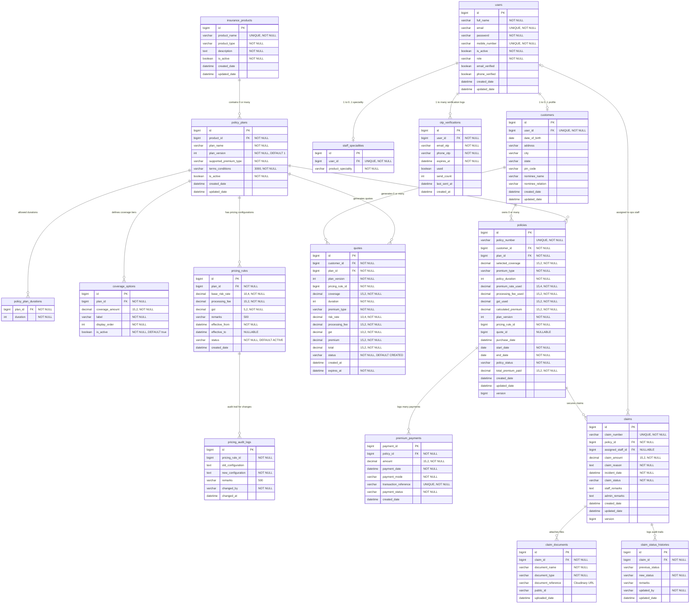

# Entity Relationship & Database Schema Diagrams

This document charts the database layout of `insurance_db`, listing columns, primary keys, foreign keys, constraints, and cardinalities.

---

## 1. Entity Relationship Diagram (ERD)

This diagram maps entity classes, properties, and foreign keys.

---

## 2. Foreign Key Definitions & Constraints

*   `customers.user_id` ➔ `users.id`
    *   Constraint: `FOREIGN KEY (user_id) REFERENCES users(id)`
    *   Behavior: Cascades operations on user deletion (profile gets wiped).
*   `staff_specialities.user_id` ➔ `users.id`
    *   Constraint: `FOREIGN KEY (user_id) REFERENCES users(id)`
*   `otp_verifications.user_id` ➔ `users.id`
    *   Constraint: `FOREIGN KEY (user_id) REFERENCES users(id)`
*   `policy_plans.product_id` ➔ `insurance_products.id`
    *   Constraint: `FOREIGN KEY (product_id) REFERENCES insurance_products(id)`
*   `policy_plan_durations.plan_id` ➔ `policy_plans.id`
    *   Constraint: `FOREIGN KEY (plan_id) REFERENCES policy_plans(id)`
*   `coverage_options.plan_id` ➔ `policy_plans.id`
    *   Constraint: `FOREIGN KEY (plan_id) REFERENCES policy_plans(id)`
*   `pricing_rules.plan_id` ➔ `policy_plans.id`
    *   Constraint: `FOREIGN KEY (plan_id) REFERENCES policy_plans(id)`
*   `quotes.customer_id` ➔ `customers.id`
    *   Constraint: `FOREIGN KEY (customer_id) REFERENCES customers(id)`
*   `quotes.plan_id` ➔ `policy_plans.id`
    *   Constraint: `FOREIGN KEY (plan_id) REFERENCES policy_plans(id)`
*   `policies.customer_id` ➔ `customers.id`
    *   Constraint: `FOREIGN KEY (customer_id) REFERENCES customers(id)`
*   `policies.plan_id` ➔ `policy_plans.id`
    *   Constraint: `FOREIGN KEY (plan_id) REFERENCES policy_plans(id)`
*   `premium_payments.policy_id` ➔ `policies.id`
    *   Constraint: `FOREIGN KEY (policy_id) REFERENCES policies(id)`
*   `claims.policy_id` ➔ `policies.id`
    *   Constraint: `FOREIGN KEY (policy_id) REFERENCES policies(id)`
*   `claims.assigned_staff_id` ➔ `users.id`
    *   Constraint: `FOREIGN KEY (assigned_staff_id) REFERENCES users(id)`
*   `claim_documents.claim_id` ➔ `claims.id`
    *   Constraint: `FOREIGN KEY (claim_id) REFERENCES claims(id)`
*   `claim_status_histories.claim_id` ➔ `claims.id`
    *   Constraint: `FOREIGN KEY (claim_id) REFERENCES claims(id)`
