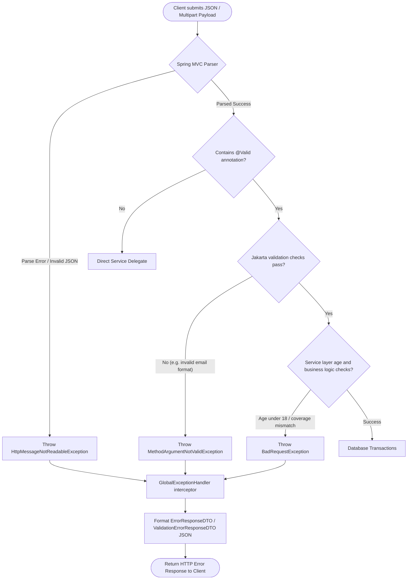
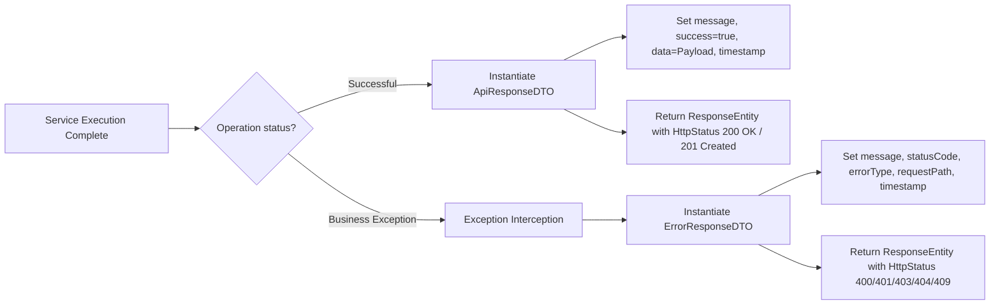
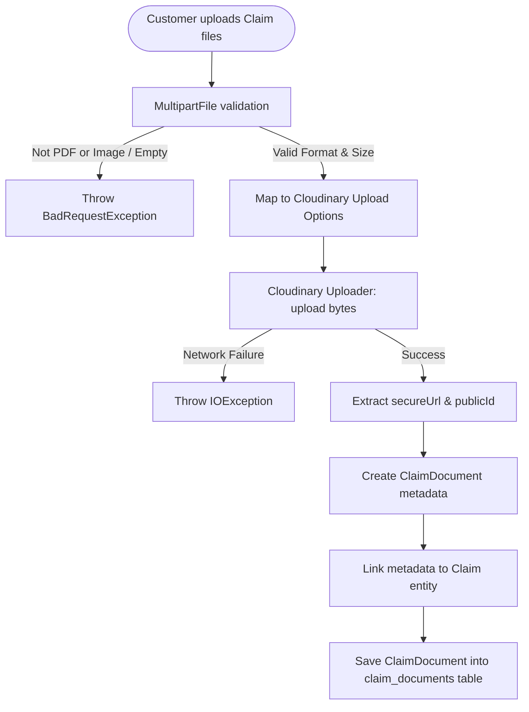
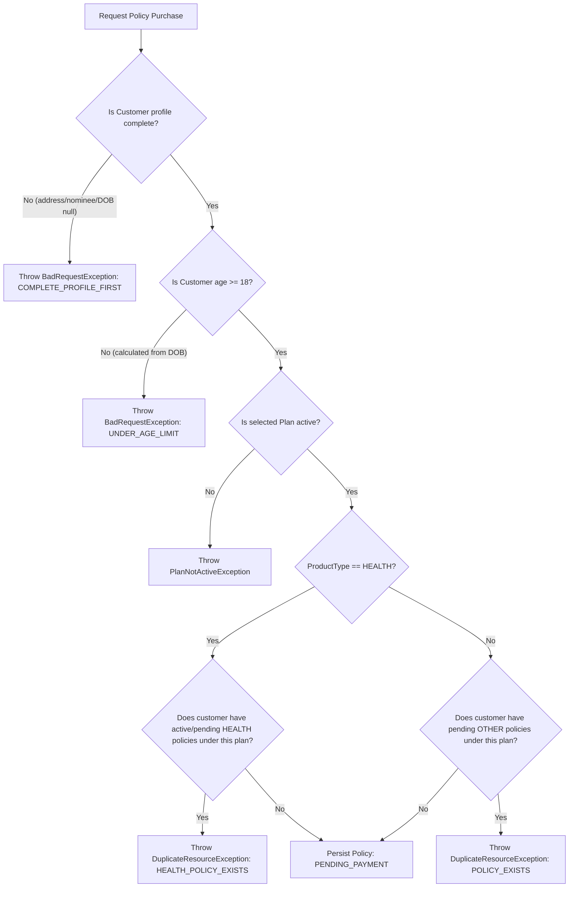

# UML Flow Diagrams

This document charts control flows, validation validations, and system interactions.

---

## 1. Request Validation Flow

This flowchart diagrams how the controller and validation rules handle inputs before services are reached.

---

## 2. API Response Wrapper Flow

---

## 3. Cloudinary Document Upload Flow

---

## 4. Policy Purchase Constraints Flow

