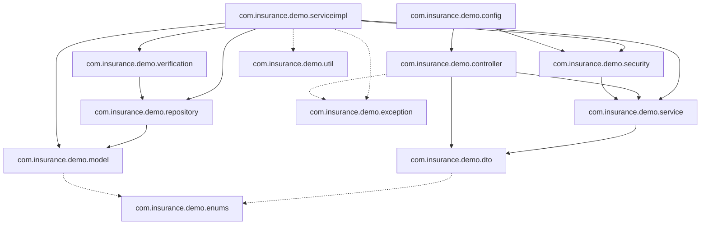

# Package Dependency Matrix

This document outlines structural dependencies and package coupling limits within the architecture.

---

## 1. Package Reference Map

In order to maintain strict separation of concerns, dependencies should flow in one direction: Controllers invoke Services, Services invoke Repositories, and Repositories access Models.

---

## 2. Layer Separation Constraints

To preserve backend architecture integrity, follow these coding guidelines:

1.  **No Direct Repository Injection into Controllers**:
    *   *Constraint*: Controllers must never access `com.insurance.demo.repository` classes directly. All DB fetches must pass through the service layer interface.
2.  **No Entity Serialization**:
    *   *Constraint*: Controllers should never return model objects (`com.insurance.demo.model`) in their method signatures. All payloads should map to `com.insurance.demo.dto.response` classes first.
3.  **Strict Speciality Isolation**:
    *   *Constraint*: Claim and Policy operations must verify the staff member's speciality (`com.insurance.demo.enums.ProductType`) before editing or returning query listings.
4.  **Decoupled Verification Dispatch**:
    *   *Constraint*: OTP generation and verification logics inside `com.insurance.demo.verification` depend on JPA models (`AppUser` and `OtpVerification`) but must remain isolated from direct policy or claim evaluation loops.
5.  **Centralized String References**:
    *   *Constraint*: Avoid magic strings. Reference all messages and field keys through `MessageConstants` inside the utility package.
