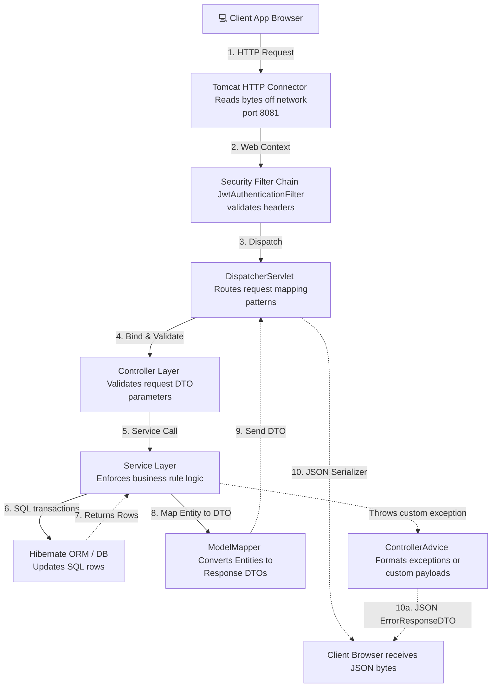

# Request-Response Lifecycle Engine

This document outlines how an HTTP request enters the JVM, gets processed, and exits as a JSON payload.

---

## 1. Request Lifecycle Pipeline

---

## 2. Spring Web Execution Trace

### Phase 1: Gateway & Authentication Filters
1. **Tomcat Engine**: Listens on port `8081`. Reads raw HTTP request bytes and creates `HttpServletRequest`.
2. **CORS Filter**: Evaluates CORS configuration properties (Origin, Methods, Headers) to accept/reject request.
3. **JwtAuthenticationFilter**: Checks the request header for `Authorization: Bearer <token>`.
   * Parses token claims.
   * If valid, sets authentication context inside `SecurityContextHolder`.

### Phase 2: Dispatching & Payload Validation
4. **DispatcherServlet**: Matches requested URI (e.g. `/api/policies/purchase`) to mapped controllers.
5. **Argument Binding**: Binds HTTP JSON body to DTO schema (`PolicyPurchaseRequestDTO`).
6. **Jakarta Validator**: Inspects payload rules:
   * Triggers `@NotNull`, `@Pattern`, `@Size` validations.
   * If a constraint is broken, throws `MethodArgumentNotValidException` to intercept execution.

### Phase 3: Transactional Business Engine
7. **Service Layer Handler**: The controller calls the transaction-scoped service interface method (e.g. `purchasePolicy()`).
8. **Entity Retrieval & Checks**:
   * Reads target database records using JPA repositories.
   * Enforces rules (e.g. customer age, coverage capacity, duplicate prevention checks).
9. **JPA Transaction Commit**: Hibernate generates target database queries. Commits row updates.

### Phase 4: Serialization & Output Generation
10. **Response DTO Mapping**: ModelMapper maps persistent entity properties to API response schemas (`PolicyResponseDTO`).
11. **JSON Parsing (Jackson)**: Converts response DTO to string representation. Writes bytes to `HttpServletResponse` wrapper.
12. **Network Response**: Tomcat closes the TCP transaction, returning structured JSON back to the customer client.
