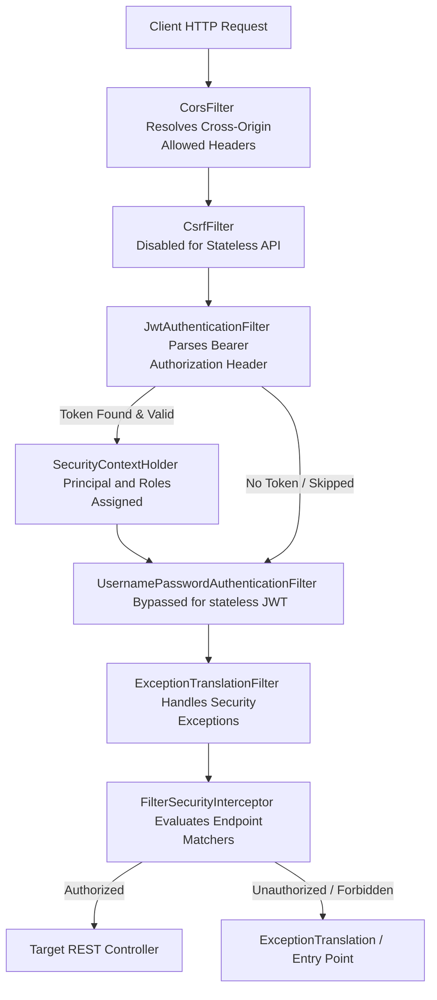
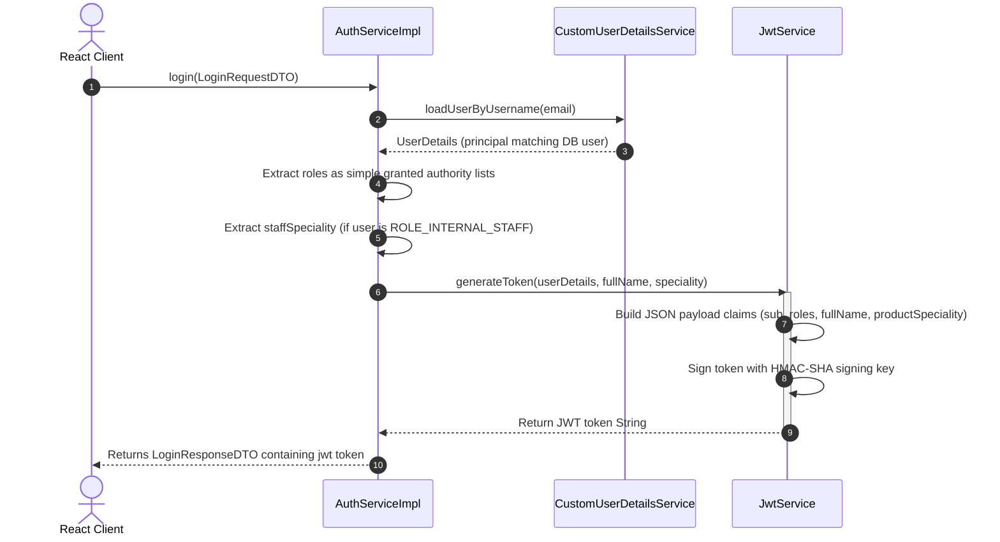
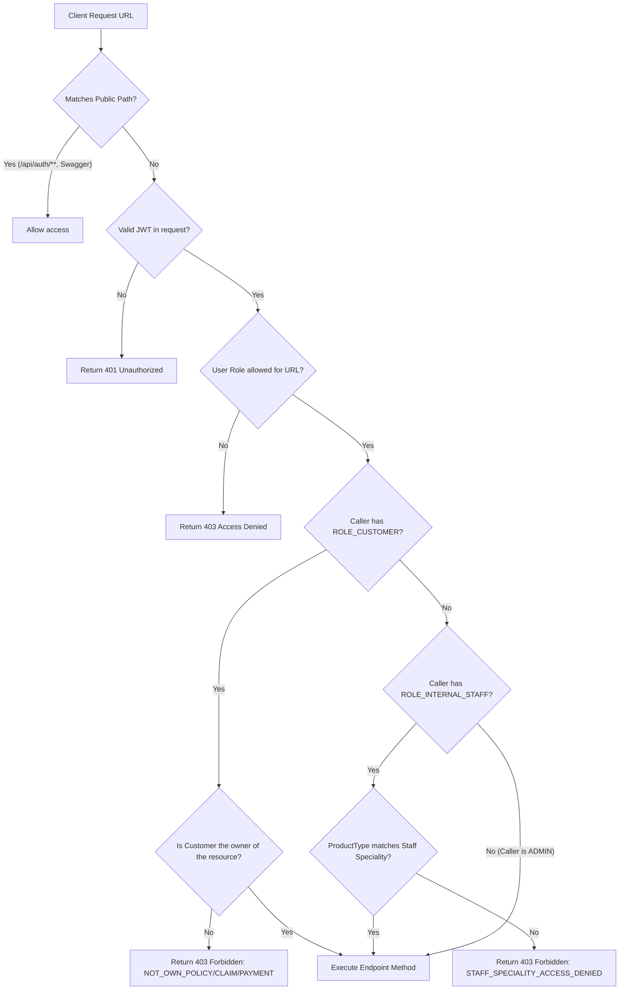

# Spring Boot Security & Filter Chain Architectures

This document breaks down the filter chain structures, JWT validation sequences, and role-based access rules.

---

## 1. Spring Security Filter Chain Pipeline

When an HTTP request hits the backend, it passes through the Web Security filter chain configuration:



---

## 2. JWT Generation Flow (Authentication Success)

When the user enters credentials, the backend generates a JWT token containing role credentials and staff specialization parameters.



---

## 3. JWT Verification & Validation Flow

Every incoming request that contains the Authorization header is parsed to verify client identity.

```mermaid
sequenceDiagram
    autonumber
    actor Client as Web Client
    participant Filter as JwtAuthenticationFilter
    participant Jwt as JwtService
    participant Details as CustomUserDetailsService
    participant Context as SecurityContextHolder

    Client->>Filter: Request Protected Route (Auth Header exists)
    activate Filter
    
    Filter->>Filter: Does Header start with 'Bearer '?
    Note over Filter: Yes, strip prefix and parse remainder
    
    Filter->>Jwt: extractUsername(token)
    activate Jwt
    Jwt-->>Filter: email (e.g. staff@insurance.com)
    deactivate Jwt
    
    Filter->>Filter: Is SecurityContext authentication null?
    Note over Filter: Yes, load credentials from DB
    
    Filter->>Details: loadUserByUsername(email)
    activate Details
    Details-->>Filter: UserDetails (matching user entity status)
    deactivate Details
    
    Filter->>Jwt: isTokenValid(token, userDetails)
    activate Jwt
    Jwt-->>Filter: true
    deactivate Jwt
    
    Filter->>Filter: Construct UsernamePasswordAuthenticationToken
    Filter->>Context: setAuthentication(authToken)
    
    Filter->>Client: Continue Filter Chain
    deactivate Filter
```

---

## 4. Protected Endpoints & Speciality Scoping

URL matching rules are managed by `SecurityConfig.java`. In addition, method security controls (`@PreAuthorize`) and internal business rules restrict data ownership.


