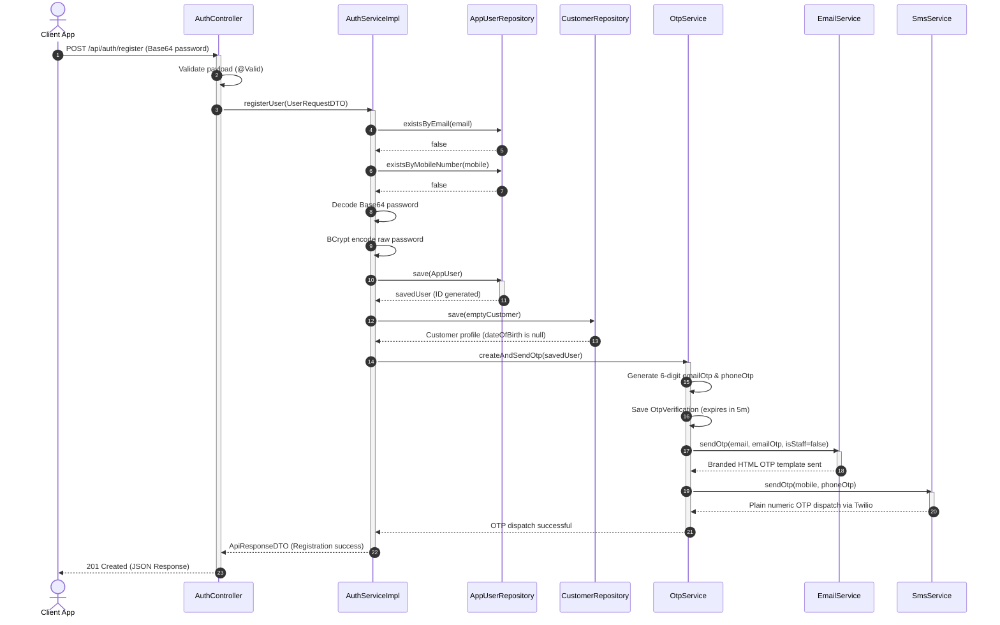
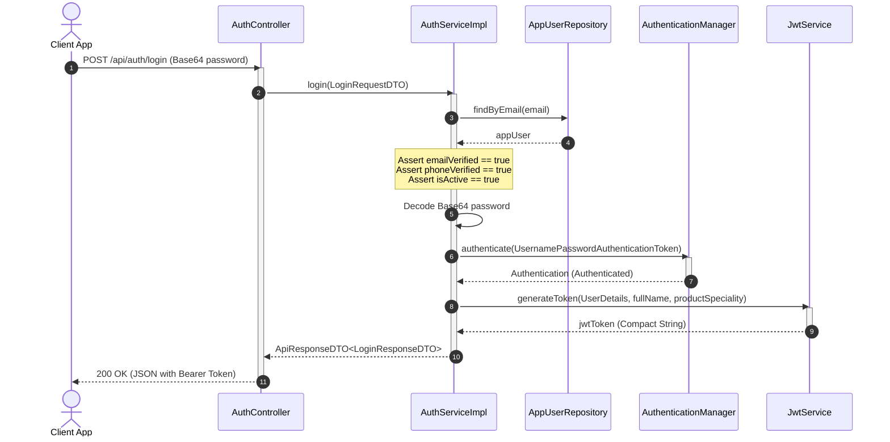
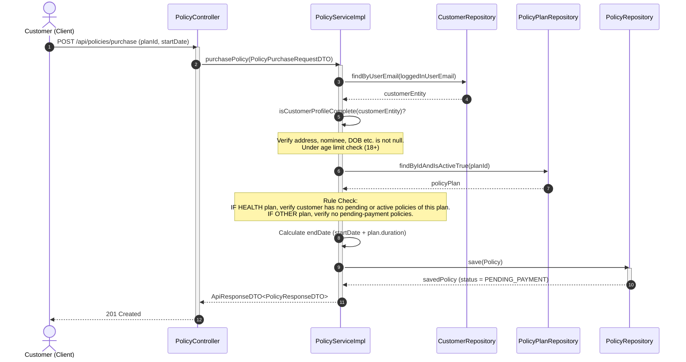
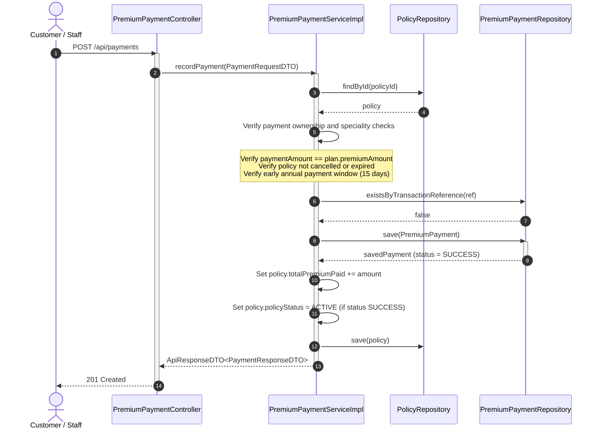
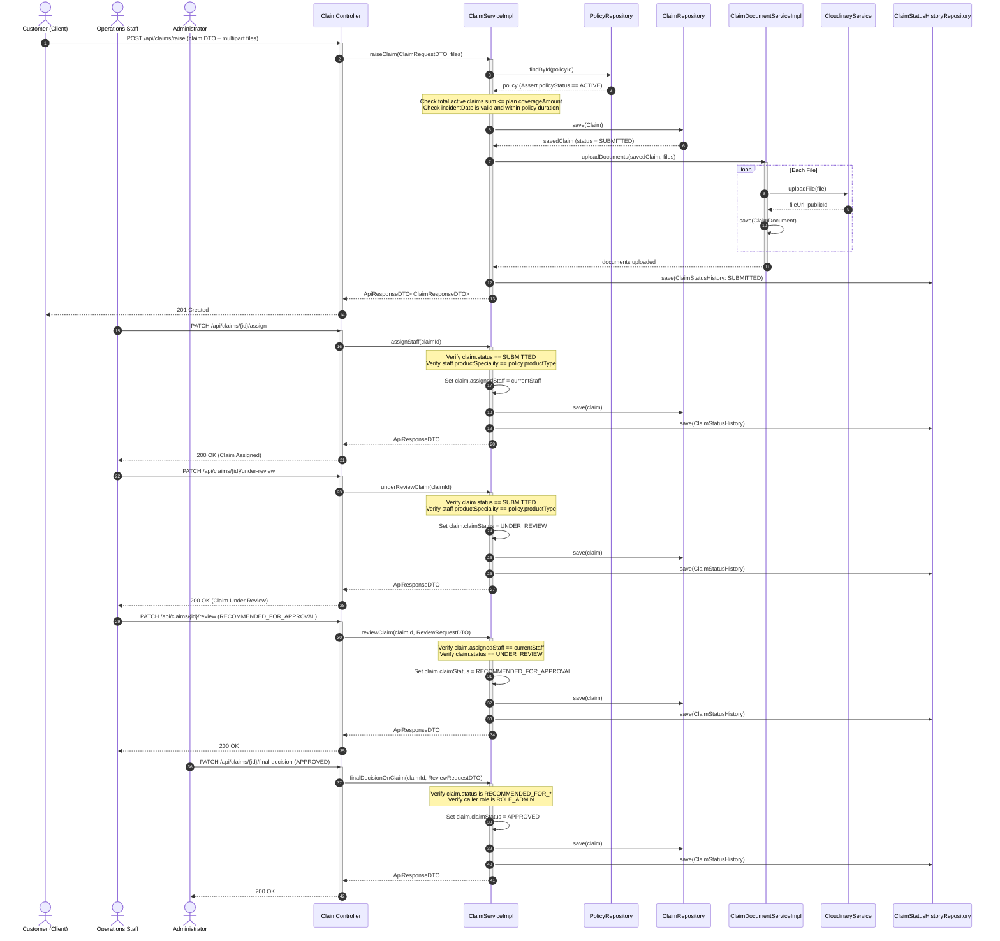

# UML Sequence Diagrams

This document illustrates the execution interactions, lifecycles, and transaction boundaries between backend components.

---

## 1. User Registration Flow

Illustrates a customer creating an unverified account and registering an initial profile.



---

## 2. Login Flow with JWT Generation



---

## 3. Request JWT Authentication & Authorization Flow

```mermaid
sequenceDiagram
    autonumber
    actor Client as Client App
    participant Filter as JwtAuthenticationFilter
    participant Details as CustomUserDetailsService
    participant UserRepo as AppUserRepository
    participant SecurityContext as SecurityContextHolder
    participant Ctrl as REST Controller

    Client->>Filter: Request Protected API (Header: "Bearer <token>")
    activate Filter
    Filter->>Filter: Extract JWT Token from header
    Filter->>Filter: Extract email (username) from claims
    
    Filter->>Details: loadUserByUsername(email)
    activate Details
    Details->>UserRepo: findByEmailAndIsActiveTrue(email)
    UserRepo-->>Details: appUser
    Details-->>Filter: UserDetails (with authorities)
    deactivate Details
    
    Filter->>Filter: Validate token (username match, expiration check)
    Filter->>SecurityContext: setAuthentication(UsernamePasswordAuthenticationToken)
    
    Filter->>Ctrl: Delegate Request to Controller Method
    activate Ctrl
    Note over Ctrl: Check Method Security (@PreAuthorize)<br/>Execute business code
    Ctrl-->>Client: REST API JSON Response
    deactivate Ctrl
    deactivate Filter
```

---

## 4. Purchase Policy Flow

Customers buying a policy plan directly.



---

## 5. Premium Payment Workflow

Processes payments and auto-activates pending contracts.



---

## 6. Claim Lifecycle & Review Workflow

Traces a customer raising a claim, staff assigning/reviewing, and admin final decisions.


