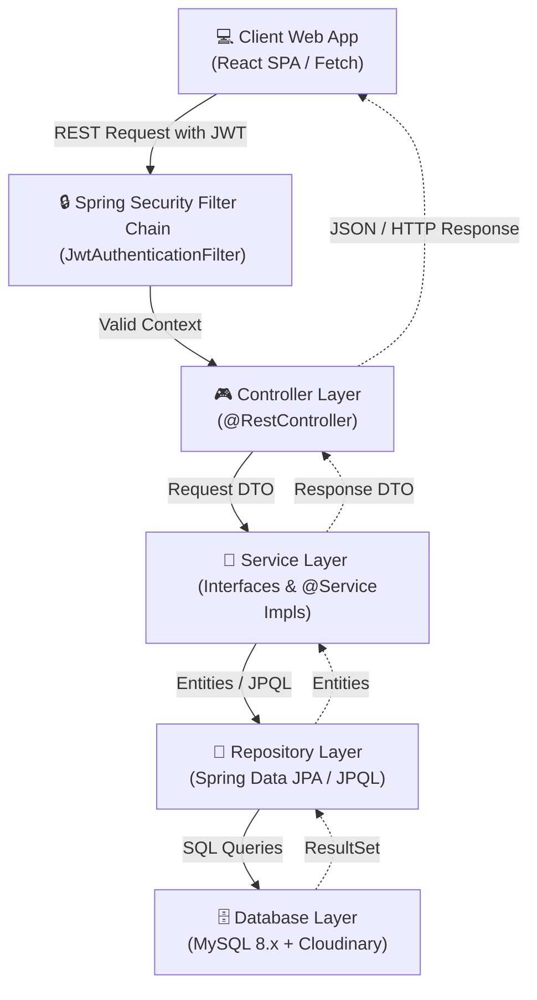

# System Architecture & Design Patterns

## 1. Layered (N-Tier) Architectural Style

The application follows the classic **Layered Architecture** pattern, providing clear separation of concerns (SoC) between presentation, security, business logic, data access, and storage.



---

## 2. Directory & Package Layout

```
com.insurance.demo/
├── DemoApplication.java          # Spring Boot main class
├── config/                       # Application configurations
│   ├── AppConfig.java            # Core Spring Bean config (ModelMapper)
│   ├── CloudinaryConfig.java     # Cloudinary media resource config
│   ├── CorsConfig.java           # Cross-Origin Resource Sharing configs
│   ├── DataInitializer.java      # System bootstrapping & setup data
│   ├── OpenApiConfig.java        # Swagger/OpenAPI interactive REST specs
│   └── SecurityConfig.java       # Spring Security Filter Chain rules
├── controller/                   # Controller layer exposing REST mappings
├── dto/                          # Data Transfer Objects
│   ├── request/                  # Client payloads and schemas
│   └── response/                 # Server response JSON schemas
├── enums/                        # Centralized domain enums
├── exception/                    # Global Exception Handler and custom exceptions
├── model/                        # JPA persistent models & DB mapping rules
├── repository/                   # Spring Data JPA data-access layer interfaces
├── security/                     # Core security elements (JWT filter & details)
├── service/                      # Business logic service layer contracts
├── serviceimpl/                  # Service implementations and engine logic
├── util/                         # Text helper generators and numeric constants
└── verification/                 # Two-factor verification layer (Email / Twilio SMS)
```

---

## 3. Core Enterprise Design Patterns

The enterprise architecture relies on several foundational software design patterns to maintain loose coupling, single responsibility, and strong isolation:

### 3.1 Controller-Service-Repository Pattern
Exhibits clean separation:
*   **Controller Layer**: Only handles HTTP parsing, Request JSON mapping, validation rules (`@Valid`), and routes request parameters to service calls.
*   **Service Layer**: Resolves authorization, transactional logic (`@Transactional`), policy constraints, limits, and domain validations.
*   **Repository Layer**: Focuses strictly on querying, locking, indexing, and returning SQL collections.

### 3.2 Data Transfer Object (DTO) Pattern
Keeps the database models decoupled from client payloads. No database entities are serialized directly to the clients, preventing:
*   Accidental data leakage (e.g. hashed user passwords, OTP tokens).
*   Broken API contracts when the underlying DB tables are altered or updated.
*   Over-fetching/serialisation overhead of lazy-loaded relationships.

### 3.3 Factory & Strategy Patterns
*   **OTP Verification (OtpService)**: Coordinates two delivery strategies (SMTP Email using Gmail, Twilio SMS for telephone dispatch) to verify user identity.
*   **Premium Calculation (PremiumCalculatorFactory)**: Selects the appropriate premium calculator based on `PremiumType` (ANNUAL vs ONE_TIME). Each calculator implements a different payment model:
    *   `AnnualPremiumCalculator` — customer pays premium each year, no lump-sum discount
    *   `OneTimePremiumCalculator` — customer pays once upfront with duration-based discount
    *   Adding new premium types (e.g., QUARTERLY, MONTHLY) requires only a new `@Component` class — no changes to factory or consumer code.
*   **Custom User Details Load**: Resolves standard Spring security principal wrappers based on email matching strategies.

### 3.4 Dynamic Query Specification Pattern
Implements `JpaSpecificationExecutor` on repository interfaces, utilizing criteria builders to run complex, multi-criteria filters on policies, payments, and claims in a paginated style.
